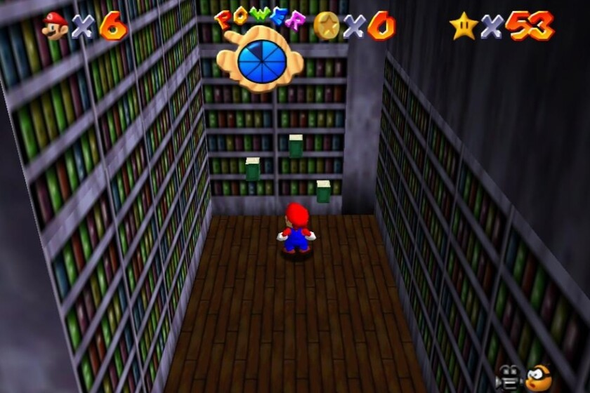

# Big Boo's Haunt

## A Multiplayer Game - TCP / UDP / Multicast / Multithreaded Ghost Game

Big Boo's Haunt is a multiplayer game based on RNG. Players can join games, and the goal is to get the most points.

Players gets points by moving around a maze trying to collide with ghosts.

Players don't know ghosts's location, but they can see if they are moving.

Player with the most points wins.

## How to use

First of all, you need to clone the repository.

    git clone https://github.com/0xRyN/Big-Boo-Haunt
    cd Big-Boo-Haunt

The project contains two directories:

-   client (the client side of the game)
-   server (the server side of the game)

The server is written in C. In order to compile, we provided a Makefile.

    cd server
    make

This will compile the server and create a binary called `server`. Run it using the following command:

    ./server

The client is written in Java. In order to compile, you can use the following command:

    cd client
    javac Client.java
    java Client <PORT>

This will run the client.

**Run the server before the client or the client will have no server to connect to.**

## Features

-   TCP Communication (Client / Server)
-   UDP Communication (Client / Client Private Messages)
-   Multicast Communication (Server / Client)
-   Multithreaded Server who serves multiple clients at once
-   Players can move into the maze and collide with walls / ghosts
-   Player score system : if the player collides with a ghost, the player gets a point
-   Multiple games possible with multiple players in each game concurrently
-   Ghosts can move in random directions
-   Crash and error handling - If the players disconnect, the server will automatically disconnect the player
-   POSIX compliant

## Project Structure

### 1) Server

-   server.c : Entry point of the server. Contains the main() function. Implements the server's logic, and handles the communication with the clients. The server is multithreaded.

-   lobby.c : Contains the lobby's logic. Lobby handles client's interaction with the server before them sending START\*\*\*. Handles basic lobby operations like REGIS, NEWPL, UNREG etc...

-   game.c : Contains the game's logic. Logic to make a player join a game, leave a game, sets up the global variables, handles game's ids, players in a game, destroys empty games, etc...

-   parser.c : Contains the parser's logic. Parses the commands sent by the clients into c types. Returns them in a pretty struct, which is then passed to the lobby or the game for handling. Uses operations.h #defines to set the correct operation.

-   send.c : Contains the send's logic. Sends the TCP data to the client. Because TCP can be a little tricky at times and split messages into chunks, we need to implement logic to send the whole message. We cound bytes sent for every send() call, and we don't stop until ALL bytes are sent. The function safe_send does exactly that.

-   receive.c : Contains the receive's logic. Receives the TCP data from the client. Because TCP can be a little tricky at times and split messages into chunks, we need to implement logic to receive the whole message. We cound bytes received for every receive() call, and we don't stop until ALL bytes are received. The function safe_receive does exactly that.

-   maze.c : Contains the maze's logic. Generates a maze, and handles the maze's parsing, movement, collisions, getting the maze's data, etc...

-   udpsender.c : Contains the udp sender's logic. Sends the UDP data to the client. Responsible for sending the UDP data to the client.

-   multicast.c : Contains the multicast's logic. Sends the multicast data to the clients. Responsible for sending the multicast data to the clients subscribed to the multicast channel.

-   in-game.c : Contains the in-game's logic. Handles the in-game's logic, like the lobby's logic, but for the in-game. Will contain all operations that are needed in the in-game. Will use game.c and maze.c for the logic. Called after the client sends START\*\*\*.

### 2) Client

Client is a CLI application. It is written in Java.

The client is responsible for the communication with the server.

The client can join a game, leave a game, send messages to the server, receive messages from the server, send private messages to clients and receive them etc...

It is multithreaded (one thread for TCP and one thread for UDP).

It contains every operation handled by the server.

Will send and receive data according to the protocol.

## Authors

**AL AZAWI Rayan** - Project Structure, Project's Structs, TCP Server, Multithreading implementation

**HAMIMI Dany** - UDP, Multicast Server implementation, Java Client

**KAABECHE Rayane** - Maze parsing, Maze movement, Maze struct, Connecting maze to game
